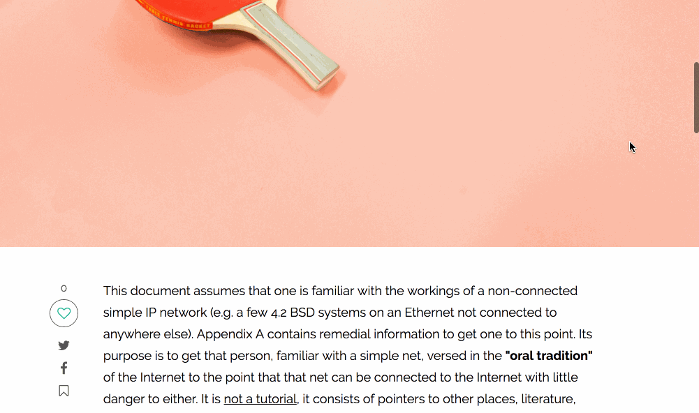

# Channel

Check out a live version of Channel here: [Channel Live](https://channeling.herokuapp.com/#/)

Channel is an open publishing platform where users can share stories and ideas with the world. Channel was inspired by the blogging platform called Medium and built using React.js with Redux on the frontend and Ruby on Rails with a PostgreSQL database on the backend.

## Features

* Create an account as well as login/logout
* Personalized feed based on followings
* View users' profile, their followers/followees, and their posts
* Create and update a post
* Determine reading time base on length of post
* Like/unlike a post
* Comment on a post
* Follow/unfollow users

## Structure

Channel is built using Ruby on Rails with a postgresSQL database. The backend routes are RESTful and they respond to asynchronous requests from the front end with JSON. By utilizing associations to prefetch data in the controller actions, queries to the database were minimalized.

All of front end rendering is done through React, which implements the flex architecture. React's virtual DOM efficiently handles diffing, resulting in fast updates of the DOM. Data in the Redux store is in a normalized form where errors, session, users, comments, and posts get their own slice of state, which makes managing relational data simpler and easier.

## Libraries

Channel uses:

* [React.js](https://reactjs.org/)
* [BCrypt](https://github.com/codahale/bcrypt-ruby) for authentication
* [Paperclip](https://github.com/thoughtbot/paperclip) to store user profile and post images using Amazon Web Services
* [Figaro](https://github.com/laserlemon/figaro) to securely store important information
* [React-Quill](https://github.com/zenoamaro/react-quill) to allow users to use a rich text editor when creating a post
* [striptags](https://github.com/ericnorris/striptags) to strip html tags from the rich text for post summaries
* [Faker](https://github.com/stympy/faker) to seed the database with comments and users
* [Moment](https://momentjs.com/) to style dates
* [react-modal](https://github.com/reactjs/react-modal) to create modals
* [react-sticky](https://github.com/captivationsoftware/react-sticky) to create a sticky for social media links and likes

## Demo

### User Authentication:

* Login/signup is one component that can be rendered by the route or on another page as a modal. For instance, if a user is not logged in but tried to like/comment on a post or follow a user, a modal would pop up, prompting the user to login/signup. While the user's profile page is not private, the edit form is protected via backend and frontend authentication. It's recommended to log in using the demo to experience all the functionalities of the app.

### Follows, Likes and Comments:

* There are several pages in which user can follow/unfollow another: post show and user show page. The button is rendered based on whether the user has followed/unfollowed the author and re-rendered when the component receives new props. On the user show page, one can look at who the user follows and who is following that user. Although the followees and followers are rendered by the same component, by keeping track of the modal state in the redux store, it is easy to distinguish which modal should be opened at any one time so that they don't overlap.

* A unique feature to Channel is a post can be liked many times similar to how clap works on Medium. Once users change their mind. They can undo all the claps at once. To implement this feature, instead of toggling the like button, the component is allowed to make as many POST requests as the users want and when hover over the like button, an unlike button shows up, allowing the users undo the likes.

* My favorite part of comment is that it expands when you click on it and collapses when you click outside of it. It also auto focus on the text area, allowing for a seamless user experience.

### Posts:

* Using a rich text editor, users can create a more visually engaging post. The picture uploading feature is handled by Paperclip and stored in AWS. Users can also edit the post using the edit link at the top of the post show page. The edit link takes users back to the same form used to create the post with all the details of the post prefilled for their convenience.  

## New Features Queue

Some features that are pending for implementation include:
* Add testing
* Allow users to reply to a comment
* Allow users to search for posts or users
* Add categories to the posts
* Make reading recommendations base on posts they have liked
* Allow users to sign up / log in using Facebook or Google accounts
* Allow users to Bookmark posts
